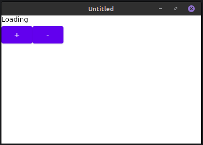
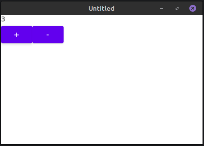
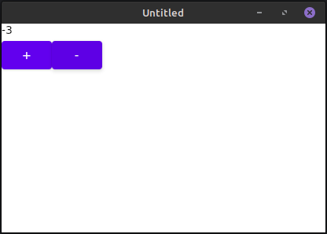

# Compose MVI

> MVI (Model-View-Intent) — это архитектурный паттерн, который входит в семейство паттернов Unidirectional Data Flow —
> подход к проектированию системы, в котором всё представляется в виде однонаправленного потока действий и управления
> состоянием.

В отличие от прочих реализаций MVI, эта библиотека позволяет хранить хранилище состояния прямо в дереве композиции
Jetpack Compose.

### Пример использования:

В качестве примера делаем экран, состоящий из двух кнопок и текстового поля с текущим числом.

Обозначим состояния экрана и действия пользователя.

```kotlin
@Immutable
sealed interface DemoState {
    data object Loading : DemoState
    data class Main(val number: Int) : DemoState
}

@Immutable
sealed interface DemoAction {
    data object Increment : DemoAction
    data object Decrement : DemoAction
}
```

Создадим реализацию обработчика этого экрана.

```kotlin
@OptIn(DelicateCoroutinesApi::class)
class DemoStore : Store<DemoState, DemoAction>(GlobalScope, DemoState.Loading) {
    override fun createTask(event: DemoAction): suspend CoroutineScope.(DemoState) -> DemoState {
        return when (event) {
            DemoAction.Decrement -> { prev ->
                when (prev) {
                    DemoState.Loading -> DemoState.Main(0)
                    is DemoState.Main -> DemoState.Main(prev.number - 1)
                }
            }

            DemoAction.Increment -> { prev ->
                when (prev) {
                    DemoState.Loading -> DemoState.Main(0)
                    is DemoState.Main -> DemoState.Main(prev.number + 1)
                }
            }
        }
    }
}
```

Создадим фабрику по производству Store - хранилищ стейта (и обработчиков событий) для экранов.

```kotlin
object DemoStoreFactory : StoreFactory(
    mapOf(
        DemoStore::class.java to Provider { DemoStore() }
    )
)
```

Реализуем разметку этого экрана на Jetpack Compose.

```kotlin
@Composable
fun DemoScreen() = StoreScope<DemoState, DemoAction, DemoStore> {
        val state by this.state.collectAsState()
        Column {
            Text(
                text = when (state) {
                    DemoState.Loading -> "Loading"
                    is DemoState.Main -> (state as DemoState.Main).number.toString()
                }
            )
            Row {
                Button(
                    onClick = { consume(DemoAction.Increment) }
                ) {
                    Text("+")
                }
                Button(
                    onClick = { consume(DemoAction.Decrement) }
                ) {
                    Text("-")
                }
            }
        }
    }
```

Будем вызывать его из функции-обертки, создающей область видимости для фабрики.

```kotlin
@Composable
fun DemoApp() = StoreFactoryScope(DemoStoreFactory) {
        DemoScreen()
    }
```

Начальное состояние:



Увеличенное число:



Уменьшенное число:

